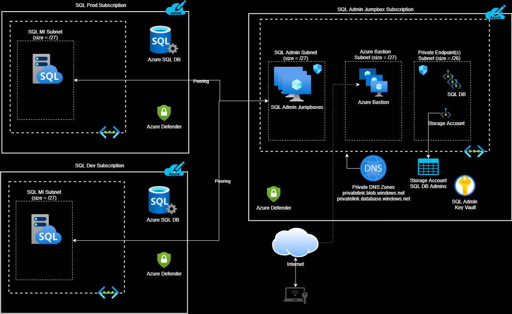

# Deploy SQL Admin Jumpbox(es)

## About


## Prerequisites

- [Bicep](https://docs.microsoft.com/en-us/azure/azure-resource-manager/templates/bicep-tutorial-create-first-bicep?tabs=azure-powershell) - Read through the Bicep tutorial to setup your environment.
- RBAC roles needed, any combination of the following:
  - Owner
  - Contributor (Not needed if Owner is already assigned)
    - Deployment of all Azure resources:
      - Virtual Network
        - Azure Bastion subnet
        - VM Jumpbox subnet
        - Private Endpoint subnet
      - Network Security Group(s) (NSG)
      - Azure Private DNS Zones
        - Blob storage account zone
        - Azure SQL Database zone
      - Storage Account
        - Private Endpoint
      - Azure Bastion Service
        - Used for connecting the Sql Admin Jumpboxes
      - Key Vault
        - Used to store VM Admin Passwords
      - Virtual Machine(s)
        - Auto update enabled
        - Auto shutdown daily, 6pm

## PowerShell Deployment

The steps outlined assumes the deployment is occurring from a workstation configured with Bicep and PowerShell. Other deployment options include Azure CloudShell via CLI or PowerShell which are not covered below. Update the parameters file before deploying.

Example 1: Deploy to Azure Commercial

```powershell
PS C:\repos\ARM\SQLAdminJumpbox> .\deployBicep.ps1
```

Example 2: Deploy to Azure Government with a specific parameters file

```powershell
PS C:\repos\ARM\SQLAdminJumpbox> .\deployBicep.ps1 -AzureEnvironment AzureUSGovernment -TemplateParameterFile .\main.parameters.gov.json
```

Example 3: Deploy to Azure Government with a specific parameters file and Azure AD tenant. The use of the TenantId would be in situations where you are a guest user in the tenant the subscription is associated with.

```powershell
PS C:\repos\ARM\SQLAdminJumpbox> .\deployBicep.ps1 -AzureEnvironment AzureUSGovernment -TemplateParameterFile .\main.parameters.gov.json -TenantId "xxxxxxxx-xxxx-xxxx-xxxxxxxxxxxx"
```
